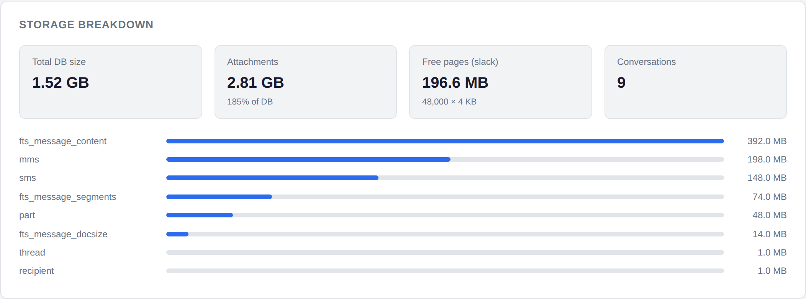
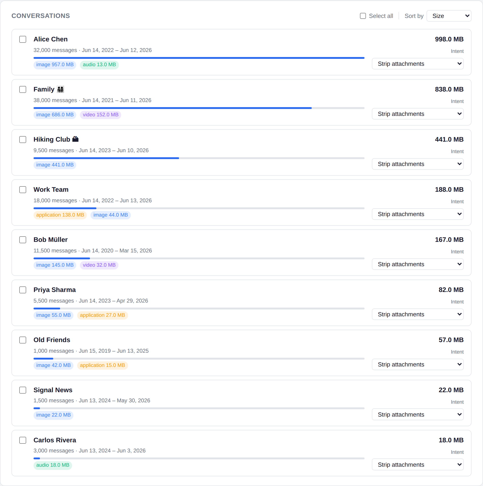
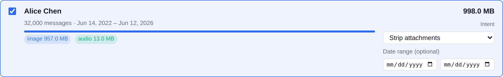
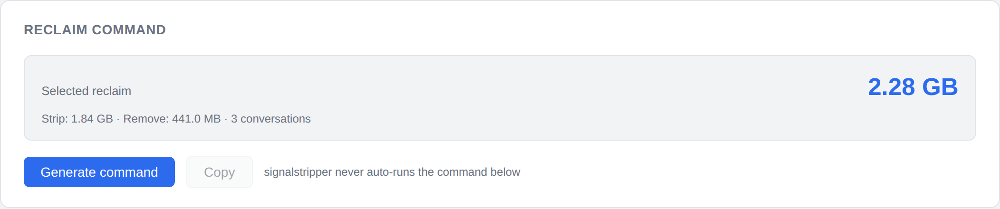
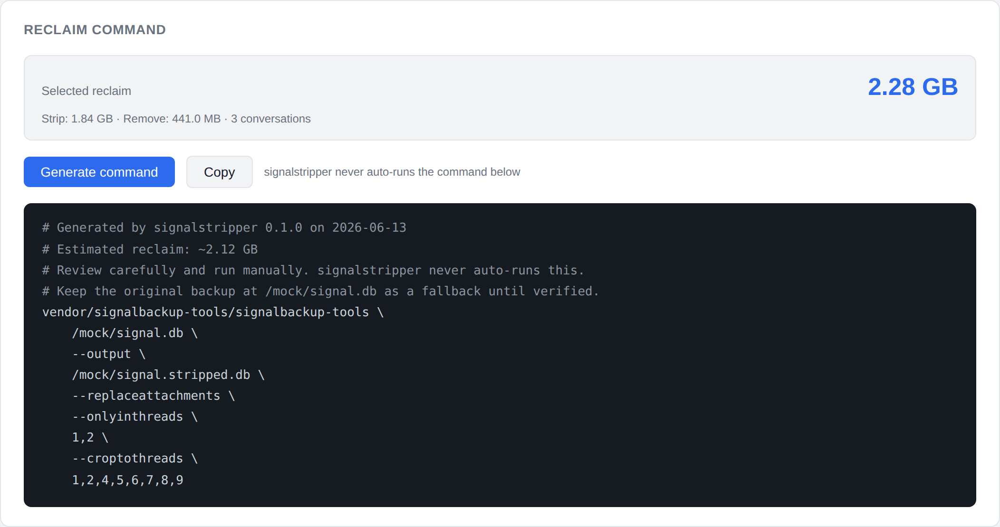

# signalstripper — Example Workflow

This walkthrough shows how to use signalstripper end to end: load a decrypted
Signal SQLite database, see where the space is going, pick conversations to
shrink, and copy out a ready-to-run `signalbackup-tools` command.

> **signalstripper never runs anything against your backup.** It only *reads*
> the database (`?mode=ro`) and *prints* a command for you to review and run
> yourself. The original backup is never modified.

The screenshots below use the built-in mock dataset (`--mock`), so you can
reproduce every step without a real backup.

---

## Launch the UI

```bash
# No real DB needed — explore the interface with synthetic data
uv run signalstripper serve --mock

# Or against a decrypted Signal database
uv run signalstripper serve --db /path/to/signal.db
```

The server binds to `127.0.0.1:8765` only. Open <http://127.0.0.1:8765> in a
browser. (Loopback is enforced — signalstripper refuses to bind to any other
host.)

---

## Step 1 — See where the space went

On load, signalstripper analyzes the database and shows a **storage breakdown**:
total DB size, how much of it is attachments, free (reclaimable) slack space,
and the largest tables.



In this example the attachments alone (2.81 GB) dwarf the live database, so
trimming media is where the wins are.

---

## Step 2 — Review your conversations

Each conversation is attributed its own storage, sorted largest-first. Cards
show the message count, date range, a size bar, and a per-type breakdown
(image / video / audio / document).



Use **Sort by** (Size / Messages / Name) to reorder, or **Select all** to act
on everything at once.

---

## Step 3 — Select a conversation and choose an intent

Click a card to select it. Two controls appear:

- **Intent** — `Strip attachments` (keep the messages, drop the media) or
  `Remove thread` (drop the whole conversation).
- **Date range (optional)** — limit the action to messages within a window.



---

## Step 4 — Mix actions and watch the running tally

Select as many conversations as you like and set each one's intent
independently. The **Reclaim command** panel keeps a live tally, split by
strip vs. remove and by conversation count, so you can see the payoff before
generating anything.



---

## Step 5 — Generate and copy the command

Click **Generate command**. signalstripper translates your selections into a
single `signalbackup-tools` invocation and shows it with safety comments. Hit
**Copy** to put it on your clipboard.



What the emitted flags mean:

| Flag | Purpose |
|------|---------|
| `--output <path>` | Writes a new database; your original is left untouched |
| `--replaceattachments --onlyinthreads <ids>` | Strips attachments only in the selected conversations |
| `--onlyolderthan` / `--onlynewerthan` / `--onlylargerthan` / `--onlytype` | Applied when you set a date range, size, or type filter |
| `--croptothreads <ids>` | Removal is expressed as its **complement** — the list of conversations to *keep* |

Conversations sharing the same date/size/type filters are batched into one
`--replaceattachments` pass automatically.

---

## Step 6 — Run it yourself

Paste the command into your terminal. It writes a new, slimmer database to the
`--output` path. **Keep the original backup until you've verified the result.**

```bash
# Example shape (yours will list your own thread IDs)
vendor/signalbackup-tools/signalbackup-tools \
    /path/to/signal.db \
    --output /path/to/signal.stripped.db \
    --replaceattachments --onlyinthreads 1,2
```

---

## CLI alternative

You don't need the browser to inspect a backup:

```bash
# Print the full storage attribution as JSON
uv run signalstripper analyze --db /path/to/signal.db
```

---

## Regenerating these screenshots

The images in `docs/images/` are produced by a Playwright capture script that
drives the mock server:

```bash
uv run python tests/fixtures/capture_docs_screenshots.py
```
